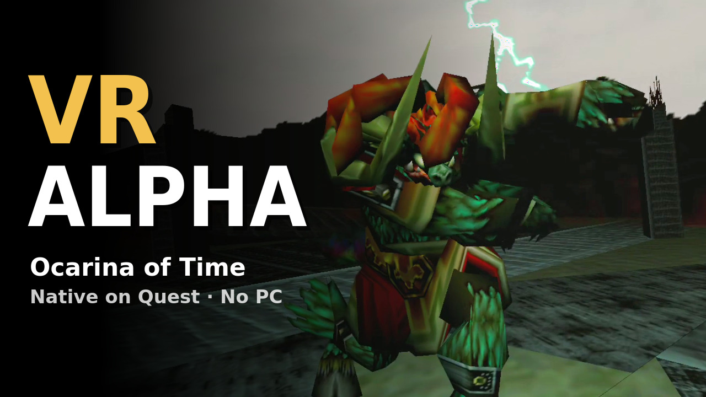
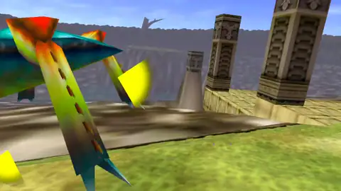
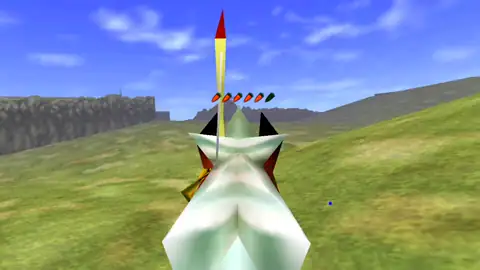
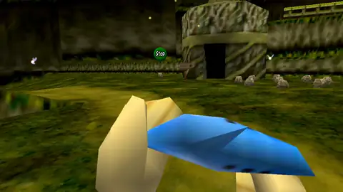
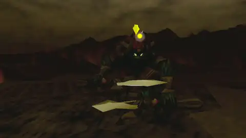
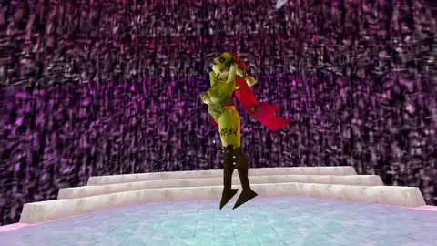

# oot-vr

_The Legend of Zelda: Ocarina of Time_ in first person on the Meta Quest 3S.
The game runs on the headset. You do not need a PC to play.

**Status: beta.** You can play the main story from Kokiri Forest to Ganon's
Tower. Some problems are known: read [`STATUS.md`](STATUS.md) and the
[open issues](https://github.com/gibranfelix/oot-vr/issues) before you play.

[](https://youtu.be/gzuzNRE-Qyo)

All clips are recordings from a Meta Quest 3S.

|                                                                                 |                                                                                                  |
| ------------------------------------------------------------------------------- | ------------------------------------------------------------------------------------------------ |
|  |                          |
| Sword and shield against a Tektite.                                             | Bow on Epona.                                                                                    |
|              |  |
| Ocarina.                                                                        | Pause screen.                                                                                    |
|                       |                          |
| Ganon.                                                                          | Great Fairy.                                                                                     |

> [!IMPORTANT]
> You must own a legal copy of _The Legend of Zelda: Ocarina of Time_. Make a
> dump of your own cartridge or disc.
>
> This repository and its releases do not contain game assets. We do not supply
> ROMs. Do not ask for ROMs or share ROMs in the issues.

## Features

- Stereo 3D.
- First-person camera at the eye height of Link. The camera follows your head.
- Motion controls: swing the sword and hold up the shield with your hands.
- Automatic world scale for child Link and adult Link.
- Menus on a panel that floats in front of you.

Tested only on the Meta Quest 3S.

## Controls

The right hand holds the sword, the boomerang, and the items that you swing.
Either hand takes a bomb, a bombchu, or a Deku nut from the belt. The left hand
holds the shield, the bow, the slingshot, the hookshot, and the ocarina.

| Control                       | Action                                                                  |
| ----------------------------- | ----------------------------------------------------------------------- |
| Left thumbstick               | Move Link.                                                              |
| Right thumbstick ← → ↓        | Put the C-Left, C-Right, or C-Down item in your hand.                   |
| Right thumbstick ↑            | Talk to Navi.                                                           |
| Right thumbstick click (hold) | Open the item selector. Move your hand to an item, then release.        |
| Left trigger                  | Use the item. For the bow, hold to pull the string, release to shoot.   |
| Right trigger                 | Z-target.                                                               |
| Right grip                    | Boomerang: hold, move the arm to throw, then release.                   |
| Both grips (hold)             | Hold the sword and the shield.                                          |
| A button                      | N64 A: action, talk, roll.                                              |
| B button                      | N64 B.                                                                  |
| Y button                      | Open or close the SoH menu.                                             |
| Left Menu button              | Start: open the pause screen.                                           |
| Left grip / right grip        | Previous page / next page of the pause screen.                          |

Swing the sword with your right hand to attack. Hold the shield in front of you
to block.

### Items

| Item                                                         | Use                                                        |
| ------------------------------------------------------------ | ---------------------------------------------------------- |
| Sword, Deku stick, Megaton Hammer                            | Swing your hand.                                           |
| Bow, slingshot, hookshot                                     | Point the weapon. The aim mark shows where the shot hits.  |
| Boomerang                                                    | Hold the right grip, throw with the arm, release the grip. |
| Bombs                                                        | Push a grip at the belt, throw with the arm, release the grip. A slow release drops the bomb. The left trigger also throws. |
| Deku nuts                                                    | The same as the bombs. The nut flashes when it touches a wall or the floor. |
| Bombchus                                                     | Push a grip at the belt, then release it. The bombchu runs where the controller points, or along a fast hand. The left trigger also puts it down. |
| Empty bottle                                                 | Left trigger.                                              |
| Ocarina, spells, masks, full bottles, other items            | The item selector uses the item immediately.               |

### Quick Setup

The first start asks how you want to turn. To change it, go to VR Settings >
**Quick Setup**:

| Setting                | Choices                                       |
| ---------------------- | --------------------------------------------- |
| View                   | First Person, Third Person                    |
| Sword Hand             | Right, Left                                   |
| Right Stick            | Items, Snap Turn, Smooth Turn                 |
| Use Items              | Item Selector, C Buttons                      |
| Hearts and Items (HUD) | In Front, On the Wrist, Left Hand, Right Hand |

The right thumbstick takes items or turns. It does not do the two:

| Right Stick | Use Items     | Take an item                                                            |
| ----------- | ------------- | ----------------------------------------------------------------------- |
| Items       | Item Selector | Flick the right thumbstick, or hold its click and move your hand.       |
| Turn        | Item Selector | Hold the right thumbstick click and move your hand.                     |
| Items       | C Buttons     | Flick the right thumbstick, or push X, B, or the left Menu button.      |
| Turn        | C Buttons     | Push X (C-Left), B (C-Down), or the left Menu button (C-Right).         |

With C Buttons, the right trigger is N64 B, and the left thumbstick click is
Start. The belt works only with the item selector. To change a button, go to VR
Settings > **Controls**.

### SoH menu

The SoH menu contains VR Settings and the settings of Ship of Harkinian. Push
the Y button to open or close it. While the menu is open, the controls operate
the menu, not Link.

| Control                         | Menu action                             |
| ------------------------------- | --------------------------------------- |
| Point a controller at the panel | Move the pointer.                       |
| Trigger of that hand            | Click.                                  |
| Right thumbstick ↑ ↓            | Scroll.                                 |
| Left thumbstick                 | Move the selection.                     |
| A button                        | Accept.                                 |
| B button                        | Go back.                                |
| Left grip / right grip          | Previous tab / next tab.                |

The game does not stop while the menu is open. With C Buttons, C-Right is on
the left Menu button.

### Ocarina

The ocarina uses the N64 layout:

| Note                          | Control                  |
| ----------------------------- | ------------------------ |
| A (D4)                        | A button                 |
| C-Up, C-Down, C-Left, C-Right | Right thumbstick ↑ ↓ ← → |
| Half step up / down           | Right grip / left grip   |
| Put the ocarina away          | B button                 |

## Install

You need:

- a cartridge or disc of Ocarina of Time that you own;
- a PC with Windows, macOS, or Linux;
- a USB-C cable for the headset.

Do these steps one time.

### 1. Make a dump of your game

Use one of these versions:

| Platform    | Region                 | Versions                                           |
| ----------- | ---------------------- | -------------------------------------------------- |
| Nintendo 64 | Europe (PAL)           | 1.0, 1.1                                           |
| Nintendo 64 | North America (NTSC-U) | 1.0, 1.1, 1.2                                      |
| Nintendo 64 | Japan (NTSC-J)         | 1.0, 1.1, 1.2                                      |
| GameCube    | Europe (PAL)           | Ocarina of Time, Master Quest                      |
| GameCube    | North America (NTSC-U) | Ocarina of Time, Master Quest                      |
| GameCube    | Japan (NTSC-J)         | Ocarina of Time, Master Quest, Collector's Edition |

Compare the SHA-1 of your dump with
[`port/docs/supportedHashes.json`](port/docs/supportedHashes.json). We tested
only the European GameCube version.

### 2. Enable developer mode on the headset

Follow the steps from Meta:
[Device Setup](https://developers.meta.com/horizon/documentation/native/android/mobile-device-setup/).

### 3. Install the game with SideQuest

1. Install [SideQuest](https://sidequestvr.com/setup-howto) on your PC.
2. Connect the headset to the PC with the USB-C cable.
3. In the headset, select **Always allow from this computer**, then **Allow**.
4. Download `oot-vr-<version>.apk` from
   [Releases](https://github.com/gibranfelix/oot-vr/releases).
5. Drag the APK into the SideQuest window.
6. With the SideQuest file manager, copy your dump into the `Download` folder
   of the headset.

With `adb`:

```
adb install -r oot-vr-<version>.apk
adb push <your-dump>.z64 /sdcard/Download/
```

### 4. Start the game

1. In the headset, open **Library** > **Unknown Sources** > **OoT VR**.
2. Select **Select ROM**, then select your dump in the `Download` folder.
3. Wait some minutes for the extraction. Do not remove the headset.
4. Optional: select **Allow** to make the folder for mods. Read [Mods](#mods).

The game makes `oot.o2r` from your dump. Then you can delete the dump. The next
starts go directly to the game.

If the game does not start, read "If the game does not start" in
[`port/Android/README.md`](port/Android/README.md).

### Alternative: make `oot.o2r` on a PC

Use this method if the extraction on the headset fails. Use **Ship of Harkinian
9.2.3 "Ackbar Delta"**.

1. Download Ship of Harkinian 9.2.3 from its
   [release page](https://github.com/HarbourMasters/Shipwright/releases/tag/9.2.3).
2. Start it and select your dump. Wait for the extraction, then close it.
3. Find `oot.o2r`:
   - Windows and Linux: in the folder of `soh.exe` or `soh.appimage`.
   - macOS: in `~/Library/Application Support/com.shipofharkinian.soh/`.
4. Copy `oot.o2r` into `Android/data/org.oot.vr/files/` on the headset.

## Mods

The game loads Ship of Harkinian mods (`.o2r` and `.otr`): textures, models,
and texts.

> [!IMPORTANT]
> This project does not contain or give mods. Get each mod from its author.

### Make the mods folder

The game needs the "All files access" permission to use the folder `oot-vr/`.

1. Select **Allow** after the first extraction. Or, in the SoH menu, select
   **VR Settings** > **Mods** > **Allow Access**.
2. Turn on the permission for OoT VR.
3. Go back to the game.

The game makes `oot-vr/mods/` and `oot-vr/Save/`. It moves your saves and
`shipofharkinian.json` into `oot-vr/`, so that they stay when you remove the
game. A copy of the old saves stays in
`Android/data/org.oot.vr/files/Save.backup/`.

### Install a mod

1. If the mod is a `.zip` file, extract it on your PC.
2. Connect the headset to the PC. Open the SideQuest file manager.
3. Copy the `.o2r` and `.otr` files into `oot-vr/mods/`.
4. Start the game again.

At the first start, **Add mods** also copies mods from the `Download` folder of
the headset. It extracts `.zip` files.

The game also reads mods from the old folder
`Android/data/org.oot.vr/files/mods/`.

A `.sav` file is a save, not a mod. The game reads it only from `oot-vr/Save/`.
Its name sets the slot: `file1.sav`, `file2.sav`, or `file3.sav`.

### Manage the mods

Open the SoH menu, and go to **Settings** > **Mod Menu**.

- **Enable Mods** turns all mods on or off.
- The list sets the load order. When two mods change the same texture, the last
  mod is visible.

### Tested mods

Tested on a Quest 3S at 72 Hz.

| Mod                                                                             | Status | Notes                                                                    |
| ------------------------------------------------------------------------------- | ------ | ------------------------------------------------------------------------ |
| [OoT Reloaded](https://github.com/GhostlyDark/OoT-Reloaded)                     | Works  | The HD version works well.                                               |
| Djipi's 3DS Experience                                                          | Works  | Large files decrease the frame rate. Do not install "01 Main Textures". |
| [Castilian Spanish Translation](https://gamebanana.com/mods/685796)             | Works  | Version 1.2b. Changes the game texts to Spanish.                         |
| [Castilian Spanish Translation font](https://gamebanana.com/mods/685796)        | Works  | The file `font_2_.zip` on the same page. Install it with the translation. |

## Build from source

Read [`port/Android/README.md`](port/Android/README.md). The script
`port/Android/build-apk.sh` builds the APK. The same document tells how to make
`oot.o2r` with the tools of this repository.

## Documentation

| File                                           | Contents                                             |
| ---------------------------------------------- | ---------------------------------------------------- |
| [`STATUS.md`](STATUS.md)                       | What works, and where to find the open work          |
| [`docs/architecture.md`](docs/architecture.md) | How the VR layer connects to the game and the engine |
| [`CONTEXT.md`](CONTEXT.md)                     | The terms that this project uses                     |
| [`CONTRIBUTING.md`](CONTRIBUTING.md)           | How to send changes                                  |
| [`AGENTS.md`](AGENTS.md)                       | Rules for contributors and for AI agents             |

## Credits

- **[ShinyWindow](https://github.com/ShinyWindow)**:
  [`Shipwright-VR`](https://github.com/ShinyWindow/Shipwright-VR) and
  [`libultraship-vr`](https://github.com/ShinyWindow/libultraship-vr). The VR
  layer comes from these projects: OpenXR, stereo render, first-person camera,
  physical combat, and many control fixes.
- **[Harbour Masters](https://github.com/HarbourMasters)**:
  [Ship of Harkinian](https://github.com/HarbourMasters/Shipwright) 9.2.3
  "Ackbar Delta", the base of this port.
- **[Kenix3](https://github.com/Kenix3)**:
  [`libultraship`](https://github.com/Kenix3/libultraship).
- **[linkzenic](https://github.com/linkzenic)**:
  [`Shipwright-Android`](https://github.com/linkzenic/Shipwright-Android), Ship
  of Harkinian on Android arm64 with GLES3.
- **[zeldaret](https://github.com/zeldaret/oot)**: the decompilation of Ocarina
  of Time.

## License

The code that this project wrote is MIT ([`LICENSE`](LICENSE)). Ship of
Harkinian, its VR layer, and the Android wrapper do not have a license.
[`NOTICE.md`](NOTICE.md) gives the license of each directory.

Zelda and Ocarina of Time are trademarks of Nintendo. This project has no
connection with Nintendo.
